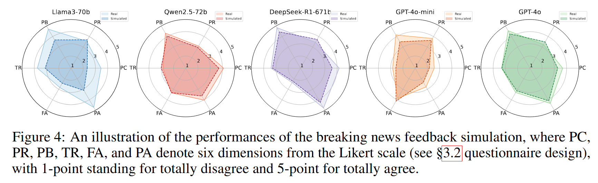

# SocioVerse
This is the official repository for the paper 🚀***SocioVerse**: A World Model for Social Simulation Powered by LLM Agents and A Pool of 10 Million Real-World Users*. 

- Welcome to try our demo here[\[✡️Demo\]](http://www.fudan-disc.com/socioverse/).
- You can download a 1,000,000 size user pool here[\[🤗User Pool\]](https://huggingface.co/datasets/Lishi0905/SimulateAnything).


### 🌟Contributions
- 🚀***SocioVerse***: a world model for social simulation comprising four powerful alignment modules；
- A pool of **10 million** real-world users;
- **Three** illustrative simulation scenarios:
  - President Election Prediction of America;
  - Breaking News Feedback;
  - National Economic Survey of China.

### Experiment Results
- **Main Experiments**


- **Further Analysis**


### Citation
We are grateful if you find our work useful, and please cite our paper as follows:
```

```
