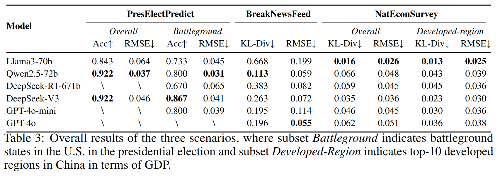

# Simulate Anything
This is the official repo for the paper 🚀***Simulate Anything**: A Generalized Social Simulation Framework Driven by LLM Agents Based on a Large-Scale Real-World User Pool*. 

[\[📄Paper Link\]]() [\[🤗User Pool\]](https://huggingface.co/datasets/Lishi0905/SimulateAnything)


### Contributions
- A generalized social simulation framework: 🚀***Simulate Anything***；
- A pool of **10 million** real-world users;
- A unified questionnaire-based evaluation method;
- **Three** applicable simulation scenarios:
  - President Election Prediction;
  - Breaking News Feedback;
  - National Economic Survey.

### Experiment Results
- **Main Experiments**


- **Further Analysis**


### Citation
We are grateful if you find our work useful and please cite Simulate Anything as follows:
```

```